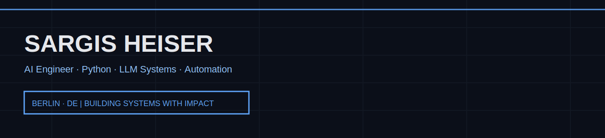

<!-- HERO:START -->

  

<!-- HERO:END -->

# Sargis Heiser  
**AI Engineer · Python · LLM Systems · Automation**  
Berlin, Germany · https://www.linkedin.com/in/sargis-heiser/ · https://github.com/sargisheiser

---

## Proof 
- **500K+ end users served** — Scalable public-sector and enterprise systems
- **170+ platforms modernized** — Public-sector and enterprise modernization programs
- **60% reduction in manual content work** — AI-enabled CMS automation and workflow optimization
- **40% faster reporting** — Python-based data pipelines and automation scripts
- **10+ client projects delivered** — End-to-end ownership across product & delivery

---

## Now building
- Build AI backend systems with Python (FastAPI, SQL) for production workflows
- Design LLM applications (RAG, agents) with evaluation & reliability in mind
- Automate data-driven processes end-to-end (APIs, pipelines, reporting)

---

## Flagship projects
### [HyperFit](https://github.com/sargisheiser/hyperfit)
---
**What it is:** AI-powered fitness analysis using computer vision and LLM-based coaching.

**Why it matters:**
- Automated movement analysis using computer vision
- LLM-driven feedback & coaching logic

**Stack:** Python, FastAPI, MediaPipe, OpenAI

—

### [WONO AI](https://github.com/sargisheiser/wono_ai-)
---
**What it is:** Automation-focused AI platform for data-driven workflows and integrations.

**Why it matters:**
- Python-based automation workflows
- API-first architecture for extensibility

**Stack:** Python, APIs, LLMs

—

### [RechnungsChecker](https://github.com/sargisheiser/rechnungschecker)
---
**What it is:** Full-stack e-invoice validation and conversion platform for German SMEs and tax advisors.

**Why it matters:**
- XRechnung & ZUGFeRD validation against official KoSIT rules
- PDF-to-e-invoice conversion with German error messages & fix suggestions
- Batch processing, webhook notifications, and complete REST API

**Stack:** Python, FastAPI, PostgreSQL, Redis, React, TypeScript, Docker

—

---

## Stack 
**AI Engineering:** LLM applications, Retrieval-Augmented Generation (RAG), Prompt engineering, AI workflow automation

**Backend:** Python, FastAPI, REST APIs, SQL, PostgreSQL

**Data:** Data processing, Automation scripts, Reporting pipelines

**Tooling:** Git, GitHub Actions, Docker, Jira, Notion

**Methods:** Agile delivery, Clean code principles, Test-driven development (TDD)

---

## Latest writing
<!-- auto-generated: fetch_blog.py | 2026-01-23 06:53 UTC -->
<!-- feed errors (non-blocking): devto: HTTPError, medium: HTTPError, github_activity: HTTPError -->
- Writing in progress — technical notes coming soon.

---

## Contact
- LinkedIn: https://www.linkedin.com/in/sargis-heiser/
- Email: sargis.heiser@gmail.com
- GitHub: https://github.com/sargisheiser

---
_Last refresh: **2026-01-23 06:53 UTC** (auto-generated)_
