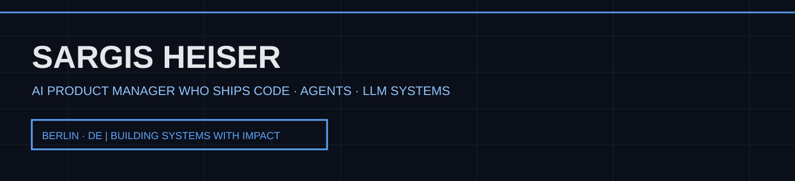

<!-- HERO:START -->

  

<!-- HERO:END -->

# Sargis Heiser
**AI Product Manager who ships code** · Agents · LLM Systems · Automation
Berlin, Germany · [LinkedIn](https://www.linkedin.com/in/sargis-heiser/) · [Email](mailto:sargis.heiser@gmail.com)

---

## Now
**Product Manager, Build & Automate @ [Blockbrain](https://blockbrain.ai)** — enterprise AI platform (Germany)

---

## Proof
- **500K+ end users served** — public-sector & enterprise systems
- **170+ platforms modernized** — public-sector & enterprise modernization programs
- **60% less manual content work** — AI-enabled CMS automation
- **40% faster reporting** — Python data pipelines & automation
- **10+ client projects delivered** — end-to-end ownership across product & delivery

---

## Side projects (built end-to-end)

### [RechnungsChecker](https://github.com/sargisheiser/rechnungschecker)
E-invoice validation & conversion for German SMEs and tax advisors.
- XRechnung & ZUGFeRD validation against official KoSIT rules, 170+ German fix suggestions
- PDF → e-invoice conversion with GPT-4o extraction, auto-validated
- Batch processing, webhooks, full REST API

**Stack:** Python · FastAPI · PostgreSQL · Redis · React · TypeScript · Docker

### [WONO AI](https://github.com/sargisheiser/wono_ai-)
SaaS that monitors WBS housing listings in Germany and matches them to user profiles.
- AI-powered listing extraction from unstructured descriptions
- AI-drafted German application letters, real-time match notifications
- Stripe subscriptions, GDPR-compliant audit logging

**Stack:** Python · FastAPI · PostgreSQL · Redis · Celery · OpenAI · Gemini

### [HyperFit](https://github.com/sargisheiser/HyperFit) · [Mobile](https://github.com/sargisheiser/HyperFit_Mobile)
AI fitness & nutrition platform — web and mobile.
- Meal recognition via computer vision
- Workout tracking with MediaPipe pose estimation
- LangChain-powered coaching assistant

**Stack:** Python · FastAPI · React · TypeScript · MediaPipe · LangChain

---

## Toolkit
**Product:** Shape Up, discovery & signal collection, feature-flag rollouts (Unleash), release management, Jira / Confluence

**AI:** LLM apps, RAG, agents, MCP, prompt engineering, LLM observability (Sentry, Langfuse)

**Build:** Python, FastAPI, SQL/PostgreSQL, React/TypeScript, Docker, GitHub Actions

---

## Contact
[LinkedIn](https://www.linkedin.com/in/sargis-heiser/) · [sargis.heiser@gmail.com](mailto:sargis.heiser@gmail.com)
